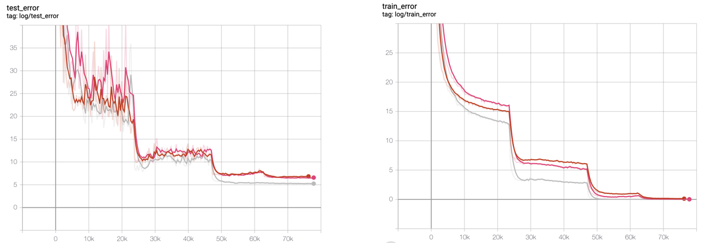

# WRN-pytorch
WideResNet: Wide Residual Network

A pytorch implementation of WRN([Zagoruyko, Sergey, and Nikos Komodakis. "Wide residual networks." arXiv preprint arXiv:1605.07146 (2016).](https://arxiv.org/abs/1605.07146))

## Support& Requirements
- 🔥pytorch >= 0.4.0
- 🐍python 3.6.5 
- 📈tensorboardX 1.8

- ‼ multi GPU support!

## Training
git clone & change DIR
```bash
$ git clone https://github.com/J911/WRN-pytorch
$ cd WRN-pytorch
```
training
```bash
$ python train.py
```
### optional arguments:    
- --lr LR
- --resume RESUME
- --layer LAYER
- --widen_factor WIDEN_FACTOR
- --batch_size BATCH_SIZE
- --batch_size_test BATCH_SIZE_TEST
- --momentum MOMENTUM
- --weight_decay WEIGHT_DECAY
- --drop_rate DROP_RATE
- --epoch EPOCH
- --num_worker NUM_WORKER
- --logdir LOGDIR

## Result

- red: resnet num_block 5 | best test loss: 6.58
- pink: num_widen_factor 2 num_block 5 | best test loss: 6.45
- grey : num_widen_factor 10 num_block 4 | best test loss: 6.19

